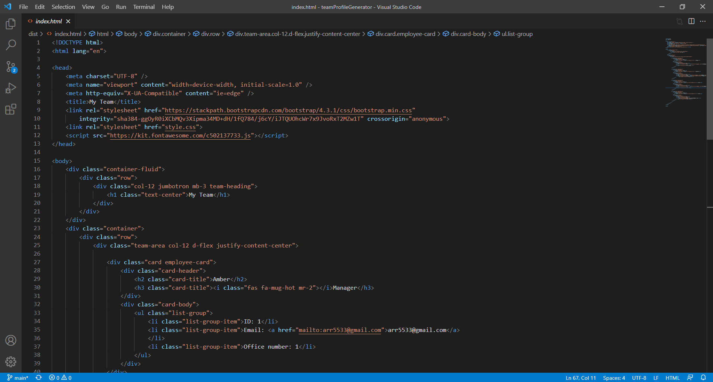
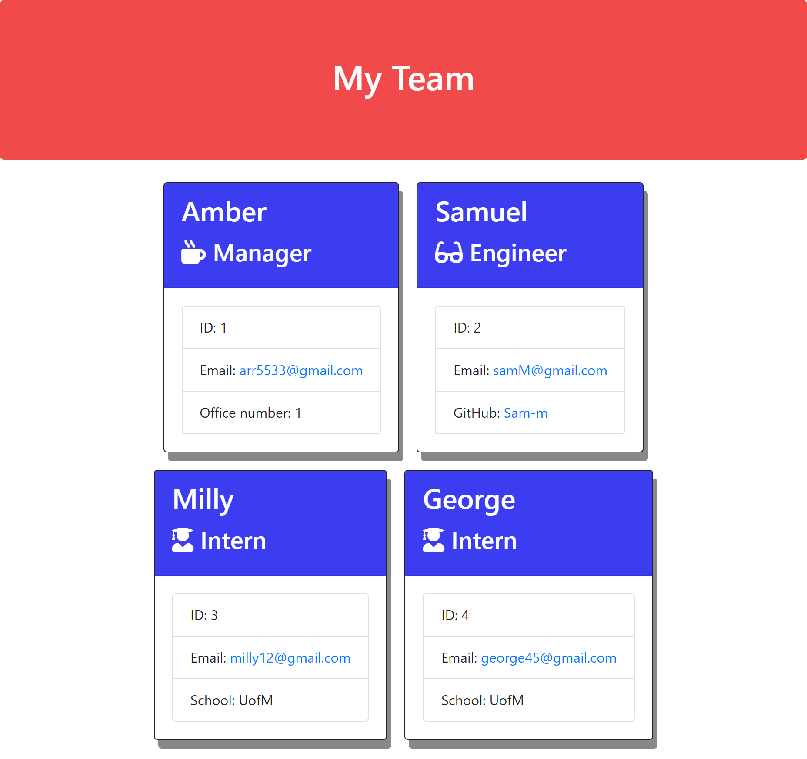
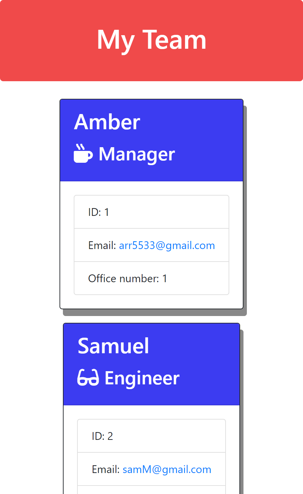

# Team Profile Generator

 ## Description

    Welcome to my Team profile generator! This application was created with Node.js using the build in package fs(File System), third-party packages Jest (for testing) and Inquirer (for collectin user input). This application is ran from the back-end and does not have a deployed page however, once running the application it does create an html page that can be view in the browser! 

  ---

  ## Table of Contents
  
  - [Usage](#usage)
  - [Installation](#installation)
  - [Walk-through video](#walk-through)
  - [Screenshots](#screenshots)
  - [License](#license)
  - [Contributions](#how-to-contribute)
  - [Questions](#questions)

  ## Usage
    Use this how you see fit to save your team on one page!

  ---

  ## Installation

    This project is ran through Node.js, clone the repo and install the required dependencies.

  ---

  ## Walk-through

    Here is a walk through video to show functionality of the application.
 

https://user-images.githubusercontent.com/94136164/150456298-69e20293-3f7f-4493-99bb-a91a9e1f9edb.mp4

    

[link to whole video](https://drive.google.com/file/d/15BAasamR3Zf0nsIqQc1_I0XyywZZybvh/view?usp=sharing "Whole walkthrough video")
  ---

  ## Screenshots

    Here are some screenshots of the deployed page created and of the html code.

    

  ---

  ## License

  [${link}](${fullLink})

  
  ---
  
  ## How to Contribute

     However you would like, just email me!

  [Contributor Covenant](https://www.contributor-covenant.org/)

  ---

  ## Questions
  
  Contact me here:   arr5533@gmail.com
  
  [My gitHub profile](https://github.com/Amber-Robeck)
